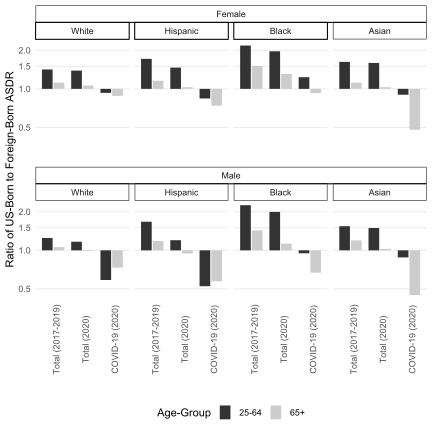
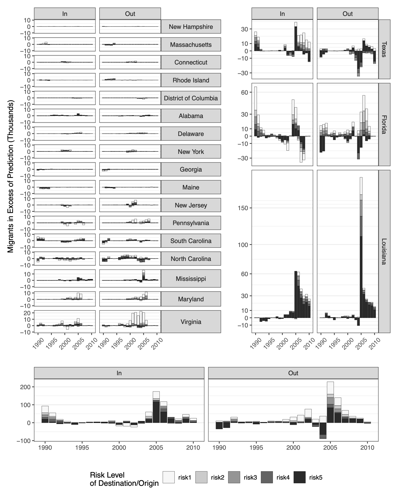
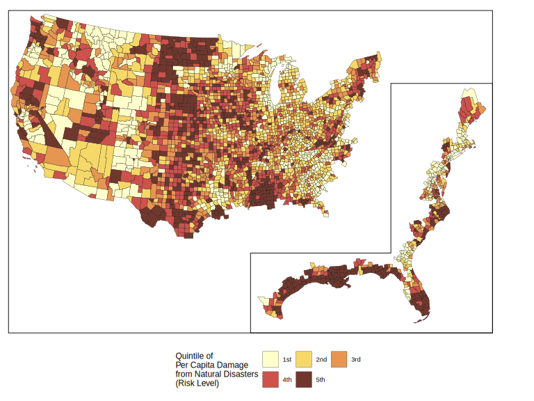
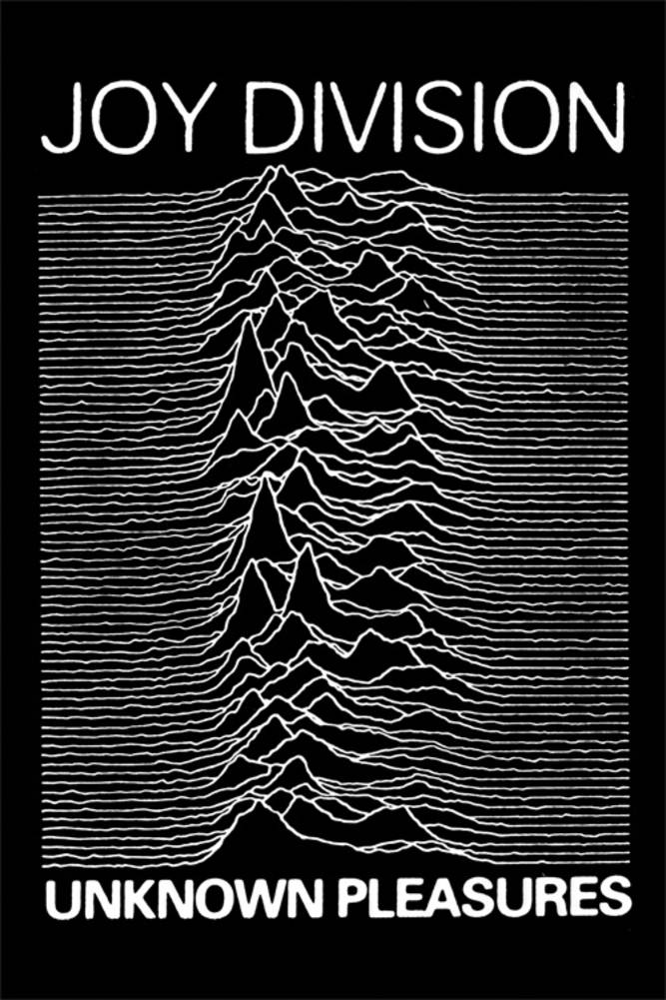

<style type="text/css">
  .reveal p {
    text-align: left;
    font-size: 0.6em;
  }
  .reveal ul {
    display: block;
    font-size: 0.6em;
  }
  .reveal ol {
    display: block;
    font-size: 0.6em;
  } 
  .reveal section img {
    border: none;
    box-shadow: none; 
  }
</style>

```{r setup, echo=F}
options(scipen = 999)

knitr::opts_chunk$set(echo = T,
                      message = F,
                      warning = F,
                      fig.align = 'center',
                      fig.height = 3,
                      fig.width = 5)
```

```{r, echo=F}
library(kableExtra)
library(ggthemes)
library(patchwork)
library(colorspace)
library(ggridges)
library(tidyverse)
```

### Building Visualization with `ggplot2`

`ggplot2` is a general purpose library for visualizing data. The key principle of `ggplot2` is the idea of building up a plot by combining different layers, each responsible for a specific function. You can learn more about `ggplot2` philosophy [here](http://vita.had.co.nz/papers/layered-grammar.pdf) but it's probably best to start with an example. We will be using the following classic dataset:

```{r}
head(iris) # Returns the first 5 elements
```

---

We wish to plot sepal length against sepal width.

```{r}
ggplot(data=iris)+ # Notice that we use + and not the pipe %>%
  geom_point(mapping=aes(x=Sepal.Length,y=Sepal.Width))
```

We specify that the data we want to use is in the `iris` object. Then we add our first layer `geom_point` and tell `ggplot2` that `Sepal.Length` should be mapped to the x-axis and `Sepal.Width` should be mapped to the y-axis.

---

Congratulations! This is your first graph. Suppose we want to change point shape based on the species.

```{r}
ggplot(data=iris) + # Notice that we use + and not the pipe %>%
  geom_point(mapping=aes(x=Sepal.Length,y=Sepal.Width,
                         shape=Species))
```

We just need to map the `Species` variable to the shape aesthetic.

---

If we felt that the shape alone is not enought to help the viewer separate points by species, we could add color:

```{r}
plot <- ggplot(data=iris,
               mapping=aes(x=Sepal.Length,y=Sepal.Width) )+
          geom_point(mapping=aes(shape=Species,color=Species)) 
plot
```

---

Suppose we want to focus on a specific portion of the graph:

```{r}
plot +
  coord_cartesian(xlim=c(6,7),ylim=c(2.5,3.5))
```

`coord_cartesian` controls the coordinates and can zoom on a part of the plot. Notice that we have stored our previous plot into the `plot` object and we are now adding more layers to it with the `+` operator.

---

We can change the axis labels and add a title:

```{r}
plot +
  labs(x='Sepal Length',
       y='Sepal Width',
       title='The Relationship of Sepal Width and Lenght')
```

---

We could also add a regression line:

```{r} 
plot +
  geom_smooth(method = 'lm', se = F,color='gray') 
```

---

Maybe it would be better to have each species in a separate graph:

```{r, fig.width=7}
plot +
  facet_wrap(~Species)
```

`facet_grid` allows to specify which variables should be used in the rows and which in the columns.

---

We are not confined to points. Here is a histogram of sepal length.

```{r}
ggplot(iris) +
  geom_histogram(mapping=aes(x=Sepal.Length),
                 bins = 10,color='black',fill='white')
```

---

There are many different geometries you can use:

- Lines: `geom_line`
- Boxplots: `geom_boxplot`
- Densities: `geom_density`
- Maps: `geom_map`
- Error Bars: `geom_errorbar`
- Uncertainty Intervals: `geom_ribbon`

and many more.

---

You can customize almost every aspect of a plot: axes, labels, grid lines, legend, orientation, size, palettes. However, `ggplot2` also offers a set of themes that modify several aspects of a figure at once:

```{r} 
plot +
  theme_minimal()
```

---

```{r} 
plot +
  theme_bw()
```

---

```{r} 
plot +
  theme_classic()
```

and more are available through the `ggthemes` package.

---

*Exercise*

Using the `iris` dataset, create a new graph with a different box plot of `Sepal.Width` for each Species. Label the axes in an appropriate way. Use the theme you prefer.

```{r,eval=F} 
ggplot(data=iris) +
  geom_*(mapping=aes(x=,y=)) +
  labs() +
  theme_*()
```

---

*Solution*

```{r} 
ggplot(data=iris) +
  geom_boxplot(mapping=aes(x=Species,y=Sepal.Width)) +
  labs(y='Sepal Width') +
  theme_bw()
```

---

Many datasets of interest come with some geographical information attached. It would be nice to show this dimension explicitly in our plots and luckily `ggplot` makes it straightforward.

First, we use the `USABoundaries` package to download a boundary file for US states.

```{r, cache=T} 
states <- USAboundaries::us_states()
states <- tigris::shift_geometry(states) 
# This is a useful function to move Alaska and Hawaii and Puerto Rico 
# in a position that makes the map more compact
```

This is a dataframe augmented with geographic information stored in the geometry column. The content of this column is what allows us to plot the data contained in this dataframe as a map.

---

We are now ready to build the map.

```{r,fig.width=8,fig.height=4} 
states %>%
  ggplot() +
  geom_sf(mapping=aes(fill=log(aland))) +
  scale_fill_viridis_c() +
  labs(fill='Land Area (log)') +
  theme_map()
```

---

The `USABoundaries` package has similar boundary files for counties, zip codes, and congressional districts and also offers the possibility to use historical boundaries. Notice that we have used the `theme_map` from the `ggthemes` package to make the final plot nicer.

As for the other types of plots, we can set the border color and  width, or even eliminate them entirely. Faceting also works in the same way as we saw for other plots and allows us to combine different maps into a unique figure.

---

Sometimes, it might seem that `ggplot` lacks the type of geometry we want. Here is an example. Suppose we want to build a bar chart in which values larger than 1 are represented by bars that raise above the vertical line `y=1` axis and values below 1 are represented by bars that raise downward from such vertical lines (this makes sense if the values are ratios). We would quickly realize that `geom_bar` or `geom_col` do not allow this behavior.

This situations are when we need to be creative. We can start by thinking that a bar is not very different from a segment with a large width. Once we've made this connection, it's trivial to realize that what we want are segments that start at `y=1` and end at some value `yend`, whether this value is larger or smaller than 1. With the appropriate width the result will be indistinguishable from a bar chart.

---

Here is how such a graph would look like:



---

The graph we just saw also illustrates another point. sometimes, we want to transform one or more of the scales. Ratios, for example, are best plotted on a log2 scale in which 2 (twice) and 0.5 (half) are symmetric around 1. `ggplot` makes it easy. We just need to add a line to the code for our plot: `plotCode + coord_trans(y='log2')`.

The `scales` package implements many common transformation and also allows you to build your own. Here is one more example in which the log10 transformation has been applied to the y axis to make the visualization more compact.


---

### Augmenting `ggplot` with other Packages

The list of functionalities provided by `ggplot` is impressive but sooner or later you will need to do something that goes beyond what this package can do. Luckily there is a high chance that someone encountered the same issue before you and coded the solution as a package. Here is a (non exhaustive) list of such packages:

 - `patchwork`: combine multiple plots in a smart and easy to code way.
 - `ggh4x`: more faceting option including nested facets! Very useful.
 - `geofacet`: provides geofaceting functionalities for `ggplot`.
 - `ggridges`: build amazing ridge plots.
 - `colorspace`: select palettes with desirable properties for your plots.

---

Here is an example of the basic usage of `patchwork` with the `mtcars` dataset.

```{r}
p1 <- ggplot(mtcars) + geom_point(aes(mpg, disp))
p2 <- ggplot(mtcars) + geom_boxplot(aes(gear, disp, group = gear))

p1 + p2
```

---

This is a more complicated example, which illustrates the flexibility of this package.

```{r, fig.height=4}
p3 <- ggplot(mtcars) + geom_smooth(aes(disp, qsec))
p4 <- ggplot(mtcars) + geom_bar(aes(carb))

(p1 | p2 | p3) /
      p4
```

Both examples are taken from `patchwork` documentation.

---

Here are two additional examples from my research.




---

We've already seen an example of nested facets using `ggh4x` here:


---

Geofaceting can be a very nice way of presenting information in a compact way. Here is an example for the US.


---

The `geofacet` package offers many different grids for different countries and levels of aggregation. However, this type of visualization can soon become confusing if the layout is too far from the underlying geography.

As a general advice, geofaceting works well when there are many units of a similar size and with relatively simple shapes. Also, the reader needs to be familiar with the map being represented.

---

The most famous example of a ridge plot is probably the cover of the Unknown Pleasures album by the British band Joy Division.



---

Ridges plots can be a way to make a visualization more compact. Here is a basic example from the package documentation using the iris dataset.

```{r}
ggplot(iris) + 
  geom_density_ridges(aes(x = Sepal.Length, y = Species))
```

While this type of plot works best with densities (computed from the data) it can also be used to plot lines (with `geom_ridgeline `).

---

Here is an example:


The main issue is that this type of plot is harder to read with discrete data (but works well if the variable mapped to the x axis takes many different values).

---

### A Few Remarks on the Use of Color

Selecting the right palette for a plot is probably one of the hardest part of building a visualization. Luckily, the R ecosystem offers many packages to help you in this journey. The one I like the most, because of it's completeness and ease of use, is `colorspace`.

`colorspace` offers a vast selection of qualitative, sequential, and diverging palettes which are designed to be perceptually uniform and colorblind safe. 

```{r, echo=F, fig.width=12,fig.height=5}
hcl_palettes(plot = TRUE)
```

---

`colorspace` offers nice functionalities to test out a palette before using it:

```{r, fig.width=12,fig.height=5}
## all built-in demos with the same sequential heat color palette
par(mfrow = c(2, 3))
cl <- sequential_hcl(5, "Heat")
for (i in c("map","heatmap","scatter","bar","perspective","lines")) {
  demoplot(cl, type = i)
}
```

---

Another useful functionality is to emulate color vision deficiencies. Here is an example for a palette with poor properties:

```{r}
par(mfrow = c(2, 2),mar=c(1,1,1,1))
demoplot(rainbow(11, end = 2/3)) # Original
demoplot(deutan(rainbow(11, end = 2/3))) # Deuteranomaly
demoplot(protan(rainbow(11, end = 2/3))) # Protanomaly
demoplot(tritan(rainbow(11, end = 2/3))) # Tritanomaly
```

---

And here is an example for a palette with better properties:

```{r, echo=F}
par(mfrow = c(2, 2),mar=c(1,1,1,1))
demoplot(divergingx_hcl(11,"Geyser",rev=T)) # Original
demoplot(deutan(divergingx_hcl(11,"Geyser",rev=T))) # Deuteranomaly
demoplot(protan(divergingx_hcl(11,"Geyser",rev=T))) # Protanomaly
demoplot(tritan(divergingx_hcl(11,"Geyser",rev=T))) # Tritanomaly
```

We encourage you to look up the documentation of `colorspace` for more functionalities (including an amazing interactive tool to create your own palettes). Other packages to deal with colors include `scico`, `RColorBrewer`, and `paletteer`. 

---

### Communicating Your Results with RMarkdown

You might have noticed how this presentation combines formatted text, R code and plots. This presentation uses RMarkdown, a system integrated in RStudio that lets you write code through a notebook interface and create reproducible documents.

If you clone the repository where I uploaded this presentation's material you'll be able to recreate this document with a simple click of the "Knit" button in RStudio.

You have many different output types you can choose from: html, markdown, doc, pdf (through LaTex), and others.

You can learn more about RMarkdown functionalities [here](https://rmarkdown.rstudio.com/lesson-1.html).
